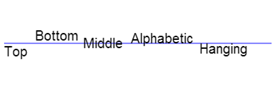

# HTML5

## SEO

搜索引擎优化

------------------------

前端工程师需要了解的seo知识：

​        1. 5至10个关键词数量是比较适中的，密度可为2%—8%。

​        2. 要重视在标题(Page Title)、段落标题(Heading)这两个网页中最重要最显眼的位置体现关键词，

​        3. 还须在网页内容、图片的alt属性、META标签等网页描述上均可不同的程度设置突出关键词。

​        4. 引出链接要人气化 外链

​        5. 关键词设定要突出

​        6. 网站架构层次要清晰 层次最好不要超过3级，层级越多seo越差

​        7. 页面容量要合理化  静态网页对seo有优势，搜索引擎很少收录动态网页，所以我们需要将动态页做成伪静态页

​        8. 网站导航要清晰化

​        9. 网站内容发布要更新 

​        10. 需要写html5的新标签替换掉 div

​        11. 减少都dom节点的深度

​        12. 减少使用 图片、声音、视频、flash ，这些对seo不友好

​	13. 将 html，css,js分开写，有利于seo

## 新语义标签

header	头部

footer	页脚

hgroup	标题组合

nav		导航

section	板块

article	文章

aside	侧边栏

time	事件或日期的标签

datalist	选项列表

datails	描述细节部分

summary	details元素的标题

dialog	定义一段对话

address	地址信息

mark	重点标记

progress	进度条

```javascript
<body>
<header>头部</header>
<section>
	新板块<br/>
	<h1>前端学习</h1>
	<h2>走向人生巅峰</h2>
<p>本来是不会做某些事情的，但装作会做</p>	
</section>
<article>
<mark>文章千古事，</mark>
得失寸心知。作者皆殊列，名声岂浪垂。<br/>
骚人嗟不见，汉道盛于斯。前辈飞腾入，馀波绮丽为。<br/>
后贤兼旧列，历代各清规。法自儒家有，心从弱岁疲。<br/>
永怀江左逸，多病邺中奇。騄骥皆良马，骐驎带好儿。<br/>
车轮徒已斫，堂构惜仍亏。漫作潜夫论，虚传幼妇碑。<br/>
缘情慰漂荡，抱疾屡迁移。经济惭长策，飞栖假一枝。<br/>
</article>
<footer>页脚</footer>
</body>
```

## 表单新控件

`email`	电子邮箱

```javascript
<input type="email" name="email" placeholder="请输入邮箱"/>
```

`rel`		电话号码

```javascript
<input type="tel" name="tel" value=""  placeholder="请输入电话号码"/>
```

`url`		网页的url地址

```javascript
<input type="url" name="url"  value="" placeholder="请输入网页地址" />
```

`search`	搜索

```javascript
<input type="search" name="search"  value="" placeholder="请输入搜索内容"/>
```

`range`	特点范围内的数值选择器

```javascript
<input type="range" name="range" max="10" value="7" min="1" />
```

`number`		数字的输入

```javascript
<input type="number" name="number" value="" placeholder="请输入数字" />
```

`color`		颜色选择器

```javascript
<input type="color" name="color" value="" placeholder="请输入颜色"/>
```

`datetime` 	显示完整的时间

```javascript
<input type="datetime" name="datetime" value=""/>
```

`datetime-local`	显示完整日期，但是不含时区

```javascript
<input type="datetime-local" name="datetime-local" value=""/>
```

`time`	显示时间，不含时区

`date` 	显示日期

`week`	显示周

`month`	显示月

```javascript
<input type="time" name="time" value=""/>
<input type="date" name="date" value=""/>  
<input type="week" name="week" value=""/>
<input type="month" name="month" value=""/>
```

`submit`		表单提交

`fornaction`		提交至

```javascript
<input type="submit" value="提交" formaction="http://www.baidu.com" />
```

`required`  表单里的必填项
`pattern`   表单里的正则

```javascript
<input type="tel" name="tel"  value="" placeholder="请输入电话号码" required= required pattern="1[3-9]\d{9}"
/> 
```

### 表单验证

`oninvalid`	验证事件

`validity` 	表单验证

`setCustomValidity`		自定义提示信息

```javascript
<script type="text/javascript">
	window.onload = function(){
var oEmail = document.getElementById('email');
var oBtn =document.getElementsByTagName('input')[1];
	oEmail.addEventListener('invalid',fn,false);
	//如果邮箱错误，提示：请输入正确的邮箱地址
	function fn(ev){
console.log(this.validity.typeMismatch);
	//可以阻止默认验证
	ev.preventDefault();
	if(this.validity.typeMismatch == true ){
	// 自定义提示信息
	this.setCustomValidity("请输入正确的邮箱地址");	
		}
	}
}
		</script>
```

### class操作

`classlist`	所有class

`add`	添加

`remove`	 删除

`toggle`		第一次删除，再点一次添加

```javascript
console.log(oDiv.classList.length);//所有class的个数
//延迟2秒添加 ac样式
setTimeout(function(){
    oDiv.classList.add('ac');
},2000);
//再隔两秒钟,删除样式b1
setTimeout(function() {
    oDiv.classList.remove('b1');
}, 4000);
	document.getElementsByTagName('button')[0].onclick = function(){
//toggle 点一次删除这个样式,再点一次添加这个样式
oDiv.classList.toggle('b');
}
```

### 数值的深浅拷贝

##### 浅拷贝

拷贝了指针指向,没有生成新的内存空间,所以,两个变量指向的是同一块内存空间

------------------------

```javascript
<script type="text/javascript">
			var arr1 = ["one","two","three"];
			var arr1To = new Array();
			arr1To = arr1;
			arr1To[2] = "存在";
			
			//console.log(arr1To);//? one two 存在
			//console.log(arr1);//? one two three
```

##### 深拷贝

对于数组或对象,拷贝了其中的元素,新生成了一段内存空间来保存,在对新的对象值进行更改时,对原对象没有任何影响

--------------------------

1. 循环

```javascript
var arr2 = ["one","two","three"];
			var arr2To = new Array();
			//1.深拷贝完成可以使用循环处理
			for(var i = 0;i<arr2.length;i++){
				arr2To[i] = arr2[i];
			}//
			arr2To[2] = "存在";
			//console.log(arr2To);//? one two 存在
			//console.log(arr2);//? one two three
```

2. 进行数组的截取

```javascript
//2.slice 进行数组的截取   来进行深拷贝
			var arr3 = ["one","two","three"];
			var arr3To = new Array();
			//1.深拷贝完成可以使用slice
			arr3To = arr3.slice(0);//对于旧数组从0号元素开始截取,一直截取到结束
			arr3To[2] = "存在";
			//console.log(arr3To);//? one two 存在
			//console.log(arr3);//? one two three
```

3. 对数组连接，实现深拷贝

```javascript
			//3.concat 数组连接 来进行深拷贝
			var arr4 = ["one","two","three"];
			var arr4To = new Array();
			
			arr4To = arr4.concat();//
			arr4To[2] = "存在";
			//console.log(arr4To);//? one two 存在
			//console.log(arr4);//? one two three
```

4. 利用json原理

```javascript
//4.用 parse 和 stringify来完成深拷贝
			var arr5 = ["one","two","three"];
			var arr5To = new Array();
			//将数组转字符串
			var arrstr = JSON.stringify(arr5);//JSON 不兼容ie7及以下浏览器
			arr5To = JSON.parse(arrstr) ;
			
			arr5To[2] = "存在";
			console.log(arr5To);//? one two 存在
			console.log(arr5);//? one two three
```

### 自定义属性

`dataset` 	获取自定义属性或设置自定义属性

```javascript
<!--data-test 自定义属性-->
		<div id="box" title="内容" data-test="hello"  data-tt-hi="word">撒打发第三方</div>
		<script>
			var oBox = document.getElementById('box');
			console.log(oBox.id);
			
			console.log(oBox.title);
			
			console.log(oBox.dataset.test);//获取自定义属性的方式
			
			console.log(oBox.dataset.ttHi);//自定义属性,在html中是短横的,在 js中需要改写为驼峰式写法
			
			
		</script>
```

### 延迟加载和异步加载

`defer`	延迟加载

`async`	异步加载

-------------------------

​        总结：js加载会影响后面页面加载

​        很多浏览器都采用了并行的加载模式

​        html5有两种加载方式 defer（延迟）  async（异步）

​        defer:延迟加载，会按顺序执行，在onload执行前被触发，特点：不会阻塞html页面的加载

​        async:异步加载，加载完就触发，有顺序问题，特点：不会阻塞html页面，对加载顺序是不确定的

​        defer 和 async图片的解释：

​        https://segmentfault.com/a/1190000018708570

-------------

```javascript
<script src="../js/1.js" defer="defer"></script><!--defer="defer" 延迟加载-->
<script src="../js/2.js"></script>
<script src="../js/4.js" async="async"></script>
<script src="../js/3.js" async="async"></script><!--async="async" 异步加载-->
```

### 路由

##### hash模式

这里的hash是指url尾巴后的#号及后面的字符。这里的#和css里的#是一个意思。hash也称作锚点，本身是用来做页面定位的，她可以使对应id的元素显示在可是区域内。由于hash值变化不会导致浏览器向服务器发出请求，而且hash改变会触发hashchange事件，浏览器的进后退也能对其进行控制，所以人们在 html5 的 history 出现前，基本都是使用 hash 来实现前端路由的。

----------------------------------

`window.location.hash`    设置hash数据

`onhashchange`	hash值改变就会触发的函数

```javascript
window.onload = function(){
				//1.获取数据
				var oBtn = document.getElementById('btn');
				var oCon = document.getElementById('con');
				//2.绑定事件
				oBtn.onclick = function(){
					//获取六位的红球
					var numArr = myRandom(1,33,6);
					console.log(numArr);
					//将随机数放到历史记录中
					window.location.hash =numArr;//hash的设置数据  set
					//将随机数放到con中
					oCon.innerHTML = numArr;
				}
				
				//给window绑定hash改变就会触发的事件
				window.onhashchange = function(){
					//console.log(30);
					console.log(window.location.hash);//但是hash值得前面会有一个#号
					//去掉 # 放到 con中
					var str = window.location.hash.substring(1);
					oCon.innerHTML = str;
				}
			}
```

##### History模式

`pushState`	设置数据

`state`	获取数据

---------------------------------

HTML5规范提供了history.pushState和history.replaceState来进行路由控制。通过这两个方法可以改变url且不向服务器发送请求。同时不会像hash有一个#,更加的美观。但是history路由需要服务器的支持，并且需将所有的路由重定向倒根页面。

已经有 hash 模式了，而且 hash 能兼容到IE8， history 只能兼容到 IE10，为什么还要搞个 history 呢？
首先，hash 本来是拿来做页面定位的，如果拿来做路由的话，原来的锚点功能就不能用了。其次，hash 的传参是基于 url 的，如果要传递复杂的数据，会有体积的限制，而 history 模式不仅可以在url里放参数，还可以将数据存放在一个特定的对象中。

vue-router默认hash模式，使用 URL 的 hash 来模拟一个完整的 URL，于是当 URL 改变时，页面不会重新加载。

不过这种模式要玩好，还需要后台配置支持。因为我们的应用是个单页客户端应用，如果后台没有正确的配置，当用户在浏览器直接访问 `http://oursite.com/user/id` 就会返回 404，这就不好看了。

所以呢，你要在服务端增加一个覆盖所有情况的候选资源：如果 URL 匹配不到任何静态资源，则应该返回同一个`index.html` 页面，这个页面就是你 app 依赖的页面。

----------------------------

```javascript
window.onload = function(){
				//1.获取数据
				var oBtn = document.getElementById('btn');
				var oCon = document.getElementById('con');
				//2.绑定事件
				oBtn.onclick = function(){
					var key = Math.random();//key不重复
					
					//获取六位的红球
					var numArr = myRandom(1,33,6);
					console.log(numArr);
					//使用 history保存 彩票信息  数据  标题(忽略)  地址(可选)
					window.history.pushState(numArr,"","#"+key);//设置  set
					/*
					hash和history的区别，在保存时，hash值是保存url地址#后边的字符串
					history 是使用 state属性保存了一个数组内容
					*/
					//将 数组 保存到 oCon中
					oCon.innerHTML = numArr;
				}
				//绑定事件  onpopstate 历史记录有变化时触发的事件
				window.onpopstate = function(ev){  //onpopstate事件
					console.log(ev);
					var result = ev.state;//获取 get
					oCon.innerHTML = result;
				}
			}
```

### 拖拽

`draggable`	设置是否拖拽

```javascript
<li draggable="true">1111</li>
```

1. 被拖拽元素的事件

   `dragstart`	拖拽前触发

   `drag`	拖拽前、拖拽结束之间，连续触发

   `dragend`	拖拽结束触发

2. 拖拽到什么元素，该元素为事件对象

   `dragenter`	进入目标元素触发

   `dragover`	进入目标、离开目标之间，连续触发

   `dragleave`	离开目标元素触发

   `drop`		在目标元素上释放鼠标触发

   - 该元素要执行，不许在dragover上阻止默认事件，不然无法执行

---------------

执行顺序：`dragstart ` \  `drag`  \  `dragenter`  \  `dragover`  \  `dragleave`   \  `dragend` 

如果有 `drop`  :   `dragstart`  \  `drag`  \  `dragenter`  \  `dragover`  \  `drop`  \  `dragend`

------------------

没有`drop`

```javascript
	<script type="text/javascript">
			window.onload = function(){
				//1.获取dom节点
				var aLi = document.getElementsByTagName('li');
				var oBox = document.getElementById('box');

				for(var i = 0;i<aLi.length;i++){
					//2.给li绑定开始拖拽的事件
					//ondragstart  开始拖拽事件
					aLi[i].ondragstart = function(){
						this.style.background = 'pink';
					}
					
					//3.绑定拖拽中的事件  连续触发的事件
					var num = 0;
					aLi[i].ondrag = function(){
						num++;
						console.log(num);
						
					}
					
					//4.绑定拖拽结束的事件
					aLi[i].ondragend = function(){
						this.style.background = "orange";
					}
				}
				
				
				//拖拽目标事件
				//1.进入目标元素
				oBox.ondragenter = function(){
					this.style.background = 'green';
				}
				
				//2.在目标元素上 连续触发的事件
				var nn = 0;
				oBox.ondragover = function(){
					nn++;
					console.log("over"+nn);
				}
				//3.离开目标元素
				oBox.ondragleave = function(){
					this.style.background = "lightcoral";
				}
				
				//4.在目标上就放开鼠标
				oBox.ondrop = function(){
					alert(666);
					
				}
				
				//拖拽事件的默认执行顺序是: 
			}
		</script>
```

存在`drop`

```javascript
	<body>
		<ul>
			<li draggable="true">1111</li>
			<li draggable="true">2222</li>
			<li draggable="true">3333</li>
		</ul>
		<div id="box">目的地</div>
		
		<script type="text/javascript">
			window.onload = function(){
				//1.获取dom节点
				var aLi = document.getElementsByTagName('li');
				var oBox = document.getElementById('box');

				for(var i = 0;i<aLi.length;i++){
					//2.给li绑定开始拖拽的事件
					//ondragstart  开始拖拽事件
					aLi[i].ondragstart = function(){
						this.style.background = 'pink';
					}
					
					//3.绑定拖拽中的事件  连续触发的事件
					var num = 0;
					aLi[i].ondrag = function(){
						num++;
						console.log(num);
						
					}
					
					//4.绑定拖拽结束的事件
					aLi[i].ondragend = function(){
						this.style.background = "orange";
					}
				}

				//拖拽目标事件
				//1.进入目标元素
				oBox.ondragenter = function(){
					this.style.background = 'green';
				}
				
				//2.在目标元素上 连续触发的事件
				//想要 ondrop触发,必须在 ondragover事件上阻止默认事件
				var nn = 0;
				oBox.ondragover = function(ev){
					nn++;
					console.log("over"+nn);
					//阻止默认事件
					//ev.preventDefault();
					return false;
				}
				//3.离开目标元素
				oBox.ondragleave = function(){
					this.style.background = "lightcoral";
				}
				
				//4.在目标上就放开鼠标
				oBox.ondrop = function(){
					alert(666);
					
				}

			}
		</script>
```

##### 拖拽的数据

`ev.dataTransfer.setData`  设置拖拽数据

`ev.dataTransfer.getData`  获取拖拽数据

```javascript
<script type="text/javascript">
			window.onload = function(){
				var oBox = document.getElementById('box');
				var aLi = document.getElementsByTagName('li');
				
				for(var i = 0;i < aLi.length; i++){
					aLi[i].ondragstart = function(ev){
						this.style.background = "red";
						//设置数据
						ev.dataTransfer.setData('key','001');
						
					}
				}
				
				//在dragover事件中阻止默认事件
				oBox.ondragover = function(ev){
					ev.preventDefault();
				}
				
				//当拖拽的dom节点放下时获取数据
				oBox.ondrop = function(ev){
					var data = ev.dataTransfer.getData('key');
					alert(data);
				}
			
			}
		</script>
```

### 设置光标样式

`ev.dataTransfer.effectAllowed`	设置光标样式

--------------------------------------------

各种光标样式

`none,copy, copyLink, copyMove, link, linkMove, move, all 和 uninitialized`

------------------------------------

### 设置光标图片

`ev.dataTransfer.setDragImage`    设置光标图片

-------------------

```javascript
<body>
		<ul>
			<li draggable="true">1111</li>
			<li draggable="true">2222</li>
			<li draggable="true">3333</li>
		</ul>
		<div id="box">目的地</div>
		
		<script type="text/javascript">
			window.onload = function(){
				var oBox = document.getElementById('box');
				var aLi = document.getElementsByTagName('li');
				var oImg = document.getElementsByTagName('img')[0];
				//需求:当开始拖拽时,设置拖拽的数据,当拖拽的dom节点放下时,看看能不能获取到该数据
				for(var i = 0;i < aLi.length; i++){
					//将i的值保存到aLi的属性里
					aLi[i].index = i;
					aLi[i].ondragstart = function(ev){
						this.style.background = "red";
						
						//设置光标样式
						//none, copy, copyLink, copyMove, link, linkMove, move, all 和 uninitialized
						ev.dataTransfer.effectAllowed = "copy";//设置的dom节点拖拽到目标位置后的光标样式
						
						//设置拖拽图片效果          (图片，光标X轴位置，光标的Y轴的位置   )
						ev.dataTransfer.setDragImage(oImg,0,0);
						
						//设置数据
						ev.dataTransfer.setData('key',this.index);//保存了下标
						
					}
				}
				
				//在dragover事件中阻止默认事件
				oBox.ondragover = function(ev){
					ev.preventDefault();
				}
				
				//当拖拽的dom节点放下时获取数据
				oBox.ondrop = function(ev){
					var data = ev.dataTransfer.getData('key');//获取了下标
					console.log(data);
					//oBox.appendChild(aLi[data]);//默认是剪切粘贴操作
					aLi[data].parentNode.removeChild(aLi[data]);
				}
			}
	
		</script>
```

##### 拖拽图片预览实例

```html
<!DOCTYPE html>
<html>
	<head>
		<meta charset="utf-8">
		<title>拖拽图片预览</title>
		<style type="text/css">
			#box{width: 400px; height: 400px; border:5px dotted #008000;}
		</style>
	</head>
	<body>
		请拖拽一张图片进行上传
		<div id="box">
			
		</div>
		
		<script type="text/javascript">
			window.onload = function(){
				//1.获取数据
				oBox = document.getElementById('box');
				oImg = document.getElementById('img');
				
				//2.给box绑定 dom移动到 目标上的事件
				oBox.ondragover = function(ev){
					ev.preventDefault();//阻止默认事件,下面需要使用 drop
					
				}
				
				//3.给box绑定dom在目标元素上放下的事件
				oBox.ondrop = function(ev){
					//
					console.log(ev);
					//3.阻止图片预览的默认事件
					ev.preventDefault();
					//4.获取文件信息
					var f1 = ev.dataTransfer.files;
					console.log(f1);
					//5.创建读取文件的对象
					var fd = new FileReader;
					
					//6.将文件读取为 base64的url格式
					//base64 图片格式作用:减少url请求,提升性能
					fd.readAsDataURL(f1[0]);
					
					//7.当 图片加载完成后,再将图片预览
					fd.onload = function(){
						console.log(this.result);
						if(f1[0].type.indexOf('image')!= -1){//如果是图片格式
						
						
							oImg.src = this.result;
						}else{//不是图片格式
							alert("请拖拽图片过来！");
						}	
					}	
				}		
			}
		</script>
	</body>
</html>
```

## Canvas

`getContext`		设置绘画环境

```javascript
var oC = document.getElementById('can');
var oGC = oC.getContext('2d');
```

##### 绘制路径

`beginPath`: 开始绘制路径
`closePath`: 结束绘制路径
`moveTo`      : 移动到绘制的新目标点
`lineTo`      :  新的目标点

```javascript
oGC.beginPath();
oGC.moveTo(20,20);
oGC.lineTo(250,170);
oGC.closePath();
```

##### 绘制方块

`fillRect` （L , T , W, H ）    填充颜色（默认黑色）

```javascript
oGC.fillRect(50,50,100,100);
```

`strokeRect`  ( L , T , W , H)     带边框的方块 ( 空心)

```javascript
oGC.strokeRect(150,150,100,100);
```

##### 设置绘图

`fillStyle`	填充颜色

```javascript
oGC.fillStyle = 'green';
```

`linewidth`	线宽度

```html
oGC.lineWidth = 10;
```

 `strokeStyle`  边线颜色

```javascript
oGC.strokeStyle = "red";
```

##### 边界绘图

- `lineJoin`       边界链接点样式
  - `mitre`   默认
  - `round`    圆角
  - `bevel`    斜角

```javascript
oGC.lineJoin = 'mitre';
oGC.lineJoin = 'round';
oGC.lineJoin = 'bevel';
```

- `lineCap`	设置或返回线条末端线帽的样式
  - butt           默认
  - round        圆角
  - square       高度多出为宽一半的值

```javascript
oGC.lineCap = 'butt';
oGC.lineCap = 'square';
oGC.lineCap = 'round';
```

##### 绘制路径2

`stroke`: 画线, 默认黑色

`fill ` : 填充, 默认黑色

```javascript
oGC.beginPath();
oGC.moveTo(100,100);
oGC.lineTo(150,150);
oGC.lineTo(200,100);
//先关闭路径
oGC.closePath();
oGC.fill();
oGC.lineJoin = 'round';
oGC.strokeStyle = 'yellow';
oGC.beginPath();
oGC.moveTo(90,90);
oGC.lineTo(160,160);
oGC.lineTo(210,90);
//先关闭路径
oGC.closePath();
oGC.stroke();
```

##### 使用路径的方法

画板有默认值设置,颜色默认为黑色,save 和 restore  是成对出现的,画比较复杂的图形时,需要对原始的默认值进行保存,使用 save;当什么时候需要恢复默认值时,就调一次restore

-----------------------

`save` :  保存路径

`restore`: 恢复路径

```javascript
oGC.fillStyle = 'red';
oGC.fillRect(30,30,100,100);
oGC.save();//保存路径
oGC.fillStyle = 'blue';
oGC.fillRect(50,50,70,70);
oGC.restore();//恢复路径
oGC.fillRect(70,70,30,30);
```

##### 矩形和删除矩形

`rect` :  矩形区域

`clearRect`: 删除一个画布的矩形区域

```javascript
oGC.rect(50,70,100,200);
oGC.fill();
oGC.clearRect(0,0,1000,800);
```

##### 圆

- `arc`(x, y, 半径, 起始弧度, 结束弧度, 旋转方向)

  - x, y：圆心位置
  - 弧度与角度的关系:  弧度 = 角度*Math.PI/180
  - 旋转方向: 顺时针(默认: false)、逆时针(true)

```javascript
oGC.beginPath();
oGC.arc(100,100,50,0,360*Math.PI/180,false);
oGC.closePath();
oGC.fill();
```

##### 贝塞尔曲线

通过`moveTo`设置起点

- `arcTo`(x1 , y1, x2, y2, r)       一次贝塞尔曲线
  - x1，y1第一组坐标
  - x2，y2第二组坐标
  - 半径

```javascript
oGC.beginPath();
oGC.moveTo(100,200);
oGC.arcTo(100,100,200,100,100);//绘制曲线
oGC.stroke();
```

- `quadraticCurveTo`（dx，dy，x1，y1）    二次贝塞尔曲线
  - dx dy     第一组控制点
  - x1 y1     第二组结束点

-----------------------

 	二次贝塞尔曲线需要两个点。第一个点是用于二次贝塞尔计算中的控制点，

​         第二个点是曲线的结束点。曲线的开始点是当前路径中最后一个点。

```javascript
	oGC.beginPath();
					oGC.moveTo(100,200);

					oGC.quadraticCurveTo(100,100,200,100);//绘制曲线
					oGC.stroke();
```

- `bezierCurveTo` (dx1,dy1,dx2,dy2,x1,y1)      三次贝塞尔曲线
  - dx1 dy1第一组控制点
  - dx2 dx2第二组控制点
  - x1 y1第三组结束点

##### 变换效果

`translate` 	偏移（从起始点为基点，移动当前坐标位置）

`rotate`		旋转

`scale`		缩放

```javascript
//偏移
oGC.translate(200,200);
//旋转
oGC.rotate(45*Math.PI/180);
//缩放
oGC.scale(0.5,0.5);
```

##### 图片

在画布里，图片有加载问题，需要等图片加载完成，在执行canvas，图片需要预加载，需要使用`onload`来预加载图片

--------------------------------------------

`drawlmage` (img，x，y，w，h)

- img为当前图片
- x，y 坐标
- w，h为宽高

```javascript
oImg.onload = function(){
    oGC.drawImage(oImg,100,200);
}
```

##### 背景

`createPattern` （img，参数）

- 参数为repeat、repeat-x、repeat-y、no-repeat
- 通过背景设置填充样式，fillRect设置填充范围

```javascript
var oImg = new Image();
oImg.src = "../img/5.jpg";
oImg.onload = function(){
    var bg = oGC.createPattern(oImg,'repeat-y');
    oGC.fillStyle = bg;
    oGC.fillRect(0,0,1000,800);

}
```

##### 渐变

`createLinearGradient` （x1，y1，x2，y2）

- 线性渐变
- 第一组参数：起始点坐标、第二组参数、结束点坐标
- `addColorStop` （位置，颜色）添加渐变点

```javascript
//线性渐变
var obj = oGC.createLinearGradient(150,100,250,400);
//添加渐变点
obj.addColorStop(0,'red');
obj.addColorStop(0.5,'yellow');
obj.addColorStop(0.7,'green');
obj.addColorStop(1,'blue');

//将渐变效果赋值给填充样式
oGC.fillStyle = obj;
oGC.fillRect(150,100,400,400);
```

`createRadialGradient` （x1，y1，r1，x2，y2，r2）

- 放射性渐变
- 第一组为第一个圆的坐标和半径，第二个圆的坐标和半径

```javascript
var obj = oGC.createRadialGradient(200,200,100,200,200,150);
//添加渐变点
obj.addColorStop(0,'red');
obj.addColorStop(0.5,'orange');
obj.addColorStop(1,'lightgoldenrodyellow');
//将渐变效果赋值给填充样式
oGC.fillStyle = obj;
```

#####　文本数据



----------------------------------

- `strokeText` （文字，x，y）
  - 文字边框
- `fillText`  （文字，x，y）
  - 文字填充
- `font` 
  - 字体大小
- `textAlign`
  - 默认是start跟left一样的效果end、right、center
- `textBaseline`
  - 文字上下的位置的方式默认：`alphabtic`

```javascript
//设置字体字号
oGC.font="60px 黑体";
//颜色设置
oGC.fillStyle = "red";
oGC.strokeStyle = "blue";

//设置字的垂直位置   top  bottom middle alphabetic(默认) hanging
oGC.textBaseline = "top";

//设置字的水平位置  start (默认)  left  center  end right
oGC.textAlign= "center";
//写字
oGC.fillText("春暖花开",0,0);
oGC.strokeText("盛世春秋",0,200);
```

##### 文本2

- `measureText（）` 以像素的指定字体宽度
  - `measureTexxt（str）.width` 	只有宽度，没有高度

 ```javascript
var width = oGC.measureText('春暖花开').width;
oGC.fillText("春暖花开",(oC.width-width)/2,(oC.height-60)/2);
 ```

##### 阴影

- `shadowOffsetX`、`shadowOffsetY`
  - x轴偏移、y轴偏移
- `shadowBlur` 
  - 高斯模糊值
- `shadowColor`
  - 阴影颜色

```javascript
//设置字体字号
oGC.font="60px 黑体";
//颜色设置
oGC.fillStyle = "red";
oGC.strokeStyle = "blue";

//设置字的垂直位置   top  bottom middle alphabetic(默认) hanging
oGC.textBaseline = "top";

//设置字的水平位置  start (默认)  left  center  end right
oGC.textAlign= "center";

/*
			shadowOffsetX、shadowOffsetY
			X轴偏移、Y轴偏移
			shadowBlur
			高斯模糊值
			shadowColor
			阴影颜色
			*/
//设置模糊
oGC.shadowOffsetX = 2;
oGC.shadowOffsetY = 3;
oGC.shadowBlur = 5;
oGC.shadowColor = "greenyellow";
//写字
oGC.fillText("春暖花开",0,0);


oGC.strokeText("盛世春秋",0,200);
```

##### 像素

- `getImageData`  （x，y，w，h）
  - 获取图像数据
- `putLmageData`
  - 设置新的图像数据
- 属性
  - `width` 一行的像素个数
  - `Height`   一列的像素个数
  - `data`   一个数组，包括每个像素的rgba四个值，注意每个值都在0~255之间的整数

```javascript
var oC = document.getElementsByTagName('canvas')[0];
var oGC= oC.getContext('2d');
oGC.fillStyle = 'blue';
//画方块
oGC.fillRect(0,0,100,100);
//获取图像数据
//oImg.data里面的数据 ,如果是 100*100 这么大的方块,数据是40000个  0-3表示一个像素点的(R,G,B,A)
var oImg = oGC.getImageData(0,0,100,100);//oImg.data 40000
//console.log(oImg);

//将图片数据画出来
for(var i = 0;i<oImg.width*oImg.height;i++){
    oImg.data[4*i] = 0;//R
    oImg.data[4*i+1] = 255;//G
    oImg.data[4*i+2] = 0;//B
    oImg.data[4*i+3] = 255;//A
}
//设置像素点
oGC.putImageData(oImg,100,100);
```

##### 像素2

- `createImageData`  （w，h） 
  - 生成新的像素矩阵，初始值是全透明的黑色，既（0,0,0,0）
- `setXY` `getXY`获取和设置指定坐标
  - `setXY`  设置指定坐标
  - `getXY`  获取指定坐标
- 图片的像素操作
  - 必须是同源下

```javascript
//1.创建图片对象
			var oImg = new Image();
			oImg.src = '../img/222.jpg';
			//2.当图片加载完成后,调用……
			oImg.onload = function(){
				//3.将图片的宽度赋值给 画板
				var h = oImg.height;
				var w = oImg.width;
				oC.width = w;
				oC.height = h*2;
				//4.画图
				oGC.drawImage(oImg,0,0);
				//5.获取像素信息
				var oImgData = oGC.getImageData(0,0,w,h);
				/*
				将 oImgData 的数据，纵向颠倒一下 
				*/
			    var newImg = oGC.createImageData(w,h);
				for(var i = 0;i< h; i++){
					for(var j = 0; j<w;j++){
						var result = [];//保存像素信息
						var color = getXY(oImgData,j,i);
						result[0] = 255-color[0];//反色
						result[1] = 255-color[1];
						result[2] = 255-color[2];
						result[3] = 255;
						//将新的数据设置到newImg中
						setXY(newImg,j,h-i,result);//h-i 做倒影
					}
				}
				//6.将图片画到画布上
				oGC.putImageData(newImg,0,oImg.height);
				
			}
			/*设置像素点*/
			function setXY(obj,x,y,color){
				console.log(y);
				var w = obj.width;//对象的宽度
				var d = obj.data;
				d[4*(y*w+x)] = color[0];//y哪一行,y*w表示某一行,  y*w+x 某一行的某一个像素点
				d[4*(y*w+x)+1] = color[1];
				d[4*(y*w+x)+2] = color[2];
				d[4*(y*w+x)+3] = color[3];
			} 
			
			/*获取像素点*/
			function getXY(obj,x,y){
				var w = obj.width;
				var d = obj.data;
				var color = [];//将要保存获取的像素点的RGBA数据
				color[0] = d[4*(y*w+x)];
				color[1] = d[4*(y*w+x)+1];
				color[2] = d[4*(y*w+x)+2];
				color[3] = d[4*(y*w+x)+3];
				return color;
			}
			
		}
```

##### 合成

`globalAlpha`  全局阿尔法值（透明度）

`globalCompositeOperation`属性设置或返回如何将一个源（新的）图像绘制到目标（已有）的图像上。

源图像 = 您打算放置到画布上的绘图。

目标图像 = 您已经放置在画布上的绘图。

- `source-over` 默认。在目标图像上显示源图像。

- `source-atop` 在目标图像顶部显示源图像。源图像位于目标图像之外的部分是不可见的。

- `source-in`   在目标图像中显示源图像。只有目标图像内的源图像部分会显示，目标图像是透明的。

- `source-out`  在目标图像之外显示源图像。只会显示目标图像之外源图像部分，目标图像是透明的。

- `destination-over`    在源图像上方显示目标图像。

- `destination-atop`    在源图像顶部显示目标图像。源图像之外的目标图像部分不会被显示。

- `destination-in`  在源图像中显示目标图像。只有源图像内的目标图像部分会被显示，源图像是透明的。

- `destination-out` 在源图像外显示目标图像。只有源图像外的目标图像部分会被显示，源图像是透明的。

- `lighter` 显示源图像 + 目标图像。

-  `copy`    显示源图像。忽略目标图像。

- `xor` 使用异或操作对源图像与目标图像进行组合。

```javascript
var oC = document.getElementsByTagName('canvas')[0];
var oGC= oC.getContext('2d');
oGC.fillRect(0,0,100,100);
oGC.globalCompositeOperation = "destination-out";
oGC.fillStyle = 'red';
//oGC.globalAlpha = 0.5;//透明度
oGC.fillRect(50,50,100,100);
```

##### 将画布倒出图像

- `toDataURL`  设置图片源
  - 火狐右键可以直接导出生成图片
- 覆盖合成

```javascript
var oC = document.getElementsByTagName('canvas')[0];
var oGC= oC.getContext('2d');
var oImg = document.getElementById('img');
oGC.fillRect(0,0,100,100);
oGC.globalCompositeOperation = "destination-over";
oGC.fillStyle = 'red';
oGC.globalAlpha = 0.5;//透明度
oGC.fillRect(50,50,100,100);
//导出
oImg.src = oC.toDataURL();
```

##### 事件

- `isPointlnPath`
  - 是否在点击范围内
  - `jCanvaScript`（`canvas`中的 `jQuery`）
    - http://jcscript.com/

```javascript
var oC = document.getElementsByTagName('canvas')[0];
var oGC= oC.getContext('2d');

//画圆
oGC.beginPath();
oGC.arc(100,100,50,0,360*Math.PI/180,true);
oGC.closePath();
oGC.fill();

//绑定点击事件
oC.onclick = function(ev){
    //alert(666);
    //获取x,y轴坐标
    var x = ev.clientX - oC.offsetLeft;
    var y = ev.clientY - oC.offsetTop;

    //检查是否在路径内
    if(oGC.isPointInPath(x,y)){
        alert(666);
    }
}
			
```

-----------------------------------------------

```javascript
//封装代码文件
<script src="jCanvaScript.1.5.18.min.js"></script>
```

--------------

```javascript
var oC = document.getElementById('can');
var oGC = oC.getContext('2d');
jc.start('can',true);//重绘
jc.circle(100,100,50,'#ff0000',1);
jc.start('can');
```

## 地理位置

`Geolocation`      

-----------------------------

- 地理位置
  - 为指定地点的经纬度
- 位置信息从何而来
  - IP地址
  - GPS全局定位
  - Wi-Fi无线网络
  - 基站

------------------------------------

- 单次定位请求：`getCurrentPosition`（参数）
  - 参数为请求成功函数、请求失败函数、数据收集方式
- 请求成功函数返回值
  - 经度 ： `coords.longitude`
  - 纬度 ： `coords.latitude`
  - 准确度 ： `coords.accuracy`
  - 海拔 ： `coords.altitude`
  - 海拔准确度 ： `coords.altitudeAcuracy`
  - 行进方向 ： `coords.heading`
  - 地面速度 ： `coords.speed`
  - 时间戳 ： `new Date（position.timestamp）`
- 请求失败函数返回值
  - 失败编码 ： `code`
  - 0 : 不包括其他错误编码中的错误
  - 1：用户拒绝浏览器获取位置信息
  - 2：尝试获取用户信息，但失败了
  - 3：设置了`timeout`，获取位置超时了
- 数据收集：`json`的形式
  - `enableHighAcuracy`：更精确的查找，默认false
  - `timeout`：指定获取地理位置的超时事件，默认不限时，单位为毫秒
  - `maximumAge`：最长有效期，在重复获取地理位置时，此参数指定多少再次获取位置。
- 多次定位请求：`watchPosition`（像`setInterval`）
  - 移动设备有用，位置改变才会触发
  - 配置参数：`frequency`更新的频率
- 关闭更新请求：`clearWatch`（像`clearInterval`）

-----------------------

#####　单次地理位置定位实列

```javascript
<body>
    <input type="button" value="获取地理位置定位" id="btn" />
        <textarea id="text"></textarea>
<script type="text/javascript">
    window.onload = function(){
    // 1.获取dom  
    var oBtn = document.getElementById('btn');
    var oText = document.getElementById('text');

    //2.绑定事件
    oBtn.onclick = function(){
        alert('开始定位……');

        //getCurrentPosition 单次地理位置定位的函数
        /*
					参数： 成功的回调
					失败的回调
					配置项
					*/
        navigator.geolocation.getCurrentPosition(function(position){
            console.log(position);
            oText.value += "精度："+ position.coords.longitude;
        },function(error){
            /*
						0  :  不包括其他错误编号中的错误
						1 :  用户拒绝浏览器获取位置信息
						2  :  尝试获取用户信息，但失败了
						3  :   设置了timeout值，获取位置超时了
						*/
            console.log(error);
        },{
            enableHighAcuracy:true,//是否精确查找
            //timeout:1000, //超时时间
            maximumAge:2000//最长时间
        });
    }
}

//处于安全性考虑,目前大多数浏览器不支持该功能

    </script>
</body>
```

##### 多次位置定位

```javascript
<body>
    <input type="button" value="获取地理位置定位" id="btn" />
        <textarea id="text"></textarea>
<script type="text/javascript">
    window.onload = function(){
    // 1.获取dom  
    var oBtn = document.getElementById('btn');
    var oText = document.getElementById('text');

    //2.绑定事件
    var timer = null;
    oBtn.onclick = function(){
        alert('开始定位……');

        //watchPosition 多次地理位置定位的函数
        //每隔多久定位一次
        /*
					参数： 成功的回调
					失败的回调
					配置项
					*/
        timer = navigator.geolocation.watchPosition(function(position){//成功的回调
            console.log(position);
        },function(error){//失败的回调
            console.log(error);
            navigator.geolocation.clearWatch(timer);//清除多次定位
        },{//配置项

        });

    }
}

//处于安全性考虑,目前大多数浏览器不支持该功能

    </script>
</body>
```

##### 百度地图API

可以使用百度地图或者其他地图软件来实现代理

```javascript
<script src="http://api.map.baidu.com/api?v=1.3"></script>
```

## 缓存

- `Cookie`存储
- `Web Storage`
  - `localStrage` (本地存储)
  - `sessionStorage` （会话存储）
- `indexed DB`
- `Application Cache` 离线缓存

##### Cookie

数据存储到计算机，通过浏览器控制添加与删除数据

--------------------------------

Cookie是一种广泛使用的存储技术

- 存储格式为Name-Value，每个name-value都是一个cookie
- Cookie可以设置允许读取的域和过期时间
- 不支持特殊字符：空格，（，），( : ) , =
- 通过cookie的name可以读取对应的Value
- 不同的浏览器对Cookie能存储的最大大小有限制

---------

- 特点

- 存储限制
  - 域名100个`cookie`，每组值大小4KB
- 客户端、服务器端，都会请求服务器（头信息）
- 页面间的cookie是共享

--------------

- 缺点
  - 存储容量有限制
  - 存储字符有限制
  - 影响效率，每次网络请求都需要将Cookie所有内容发送到Web服务器，造成流量浪费，影响请求响应速度
  - Cookie传输带来安全问题

###### jquery.cookie.js

`jquery.cookie.js`是一个简单、轻量级的进行cookie读、写、删除的`jQuery`插件

```javascript
<script src="jquery-1.9.0.min.js"></script>
<script src="jquery.cookie.js"></script>
<script src="md5.js"></script>
<script>
    //1.创建cookie
    $.cookie("age","18");
$.cookie("name","lili");
$.cookie("sex","男");
//$.cookie("test",{"aa":"1","bb":"2"});//这种写法是错的   如果存的是对象,需要将对象转为 json字符串进行存储;取出后再转为 json对象
var jsonstr = JSON.stringify({"aa":"1","bb":"2"});
$.cookie("test",jsonstr)

//将内容加密后放到cookie
$.cookie( "jiami",str_md5("hello")  );

//2.创建cookie时设置过期时间
$.cookie("tel","15812345678",{expires:4});

//3.创建指定路径的cookie
$.cookie("class","二年级",{expires:1,path:"/"});

//4.读取cookie
console.log($.cookie('class'));
console.log(JSON.parse($.cookie('test')));

//删除cookie
$.removeCookie("sex");
console.log($.cookie("jiami"));
</script>
```

##### 本地存储 Storage

- 特点
  - 存储量限制（5M）
  - 客户端完成，不会请求服务器处理
  - `sessionStorage` 数据是不共享、`localStorage`共享

-------------------------------------

- `sessionStorage`
  - `session`临时会话，从页面打开到页面关闭的时间段
  - 窗口的临时存储，页面关闭，本地存储消失
- `localStorage`  
  - 永久存储（可以手动删除数据）

```javascript
console.log(window.sessionStorage.getItem("text"));//null 没有获取到数据
console.log(window.localStorage.getItem("text"));//表示 localStorage 数据可以跨页
```

###### Storage操作

- `setltem()`
  - 设置数据，key\value，类型都是字符串
  - 可以用获取属性的形式操作
- `gettitem()`
  - 获取数据，通过key来获取到相应的value
- `removeltem()` 
  - 删除数据，通过key来删除相应的value
- `clear()`
  - 删除全部存储的值

```javascript
var aInput = document.getElementsByTagName('input');
var oDiv = document.getElementById('con');

//绑定 将字符串保存成本地缓存
aInput[0].onclick = function(){
    window.sessionStorage.setItem('text',aInput[4].value);
    window.sessionStorage.setItem('age',12);
}
//获取
aInput[1].onclick = function(){
    oDiv.innerHTML = window.sessionStorage.getItem('text');

}

//删除
aInput[2].onclick = function(){
    window.sessionStorage.removeItem('text');

}

//清除所有
aInput[3].onclick = function(){
    window.sessionStorage.clear();

}
```

###### 存储事件

- 当数据有修改或删除的情况下，就会触发`storage`事件
- 在对数据进行改变的窗口对象上是不会触发的
- key：设置或删除的key值，如果调用clear(),key为null
- `newValue`:新设置的值，如果调用`removeStorage()`,key为null
- `oldValue`：调用改变前的value值
- `storageArea`：当前的storage对象
- `url`:触发该脚本变化的文档的`url`

```javascript
if(window.addEventListener){
    window.addEventListener("storage",showStorage,true);
}else{
    window.attachEvent("onstorage",showStorage);
}
//storage 缓存在 页面更改的时候,会触发该事件
function showStorage(ev){
    var ev = ev || window.event;
    console.log(ev);
    /*
				Key : 设置或删除的key值，如果调用clear(),key为null
				newValue  :  新设置的值，如果调用removeStorage(),key为null
				oldValue :  调用改变前的value值
				storageArea : 当前的storage对象
				url */
    console.log("Key:"+ev.key);
    console.log("newValue:"+ev.newValue);
    console.log("oldValue:"+ev.oldValue);
    console.log("storageArea:"+ev.storageArea);
    console.log("url:"+ev.url);
}
```

##### 离线存储

离线存储应用是什么？

- 乘坐飞机、手机信号弱、去演讲的时候，可能没有网络，这个时候就可以使用离线应用

离线应用的好处？

- 没网络的时候，可以正常访问
- 快速相应页面，不必用多个HTTP占用资源带宽
- 缓存的可以是任何文件
- 用在静态的手机网页或是游戏好用

##### 搭建离线应用程序

- `html`标签加 : 
  - `umanifest`=`“xxxxx.manifest”`

- 写`manifest`文件 :  离线的清单列表
  - 先写 :  `CACHE MANIFEST`
  - `CACHE`:需要缓存的都放在`CACHE`下面

  - `FALLBACK `:  访问失败后的重定向
  - 第一个资源文件为能够在线访问时使用的资源文件，第二个资源文件为

  - 不能在线访问时使用的备用资源文件

  - `NETWORK` ：无论缓存中存在与否，均从网络获取

  - 使用星号来指示所有其他资源/文件都需要因特网连接

##### Workers

什么是worker？

- JS的单线程（放入UI队列的个数，利用定时器解决）
- 可以让web应用程序具备后台处理能力，对多线程的支持非常好

-------------

Worker API

- new Worker （“后台处理的js地址”）
- 利用`postMessage`传输数据
- `importScripts`（“导入其他JS文件”）

## 音频和视频

- `audio`音频
- `video`视频

```javascript
<audio controls="controls">
    <source src="data/1.ogg"></source>
<source src="data/1.mp3"></source>
</audio>

<video src="data/1.mp4" controls="controls">浏览器不支持该标记</video>
```

###### 视频容器

- 容器文件，类似于压缩一组文件
  - 音频轨迹
  - 视频轨道
  - 元数据：封面，标题，字幕等

###### 编解码器

- 原始的视频容器非常大，添加需要解码，播放需解码
- 音频编解码器
  - `AAC`
  - `MPEG-3`
  - `Ogg Vorbis`
- 视频编解码器
  - `H.264`
  - `VP8`
  - `Ogg Theora`

###### 媒体元素

- `controls` : 显示或隐藏用户控制界面
- `autoplay`：媒体是否自动播放
- `loop`：媒体是否循环播放
- `currentTime`：开始到播放现在所用的时间
- `duration`： 媒体总时间（只读）
- `volume`：0.0-1.0的音量相对值
- `muted`：是否静音
- `paused`：媒体是否暂停（只读）
- `ended`： 媒体是否播放完毕
- `currentSrc`：以字符串的形式返回媒体文件（只读）

```javascript
<body>
		<video src="data/1.mp4" controls="controls" loop="loop">浏览器不支持该标记</video>
		<button>获取属性</button>
		
		<script type="text/javascript">
			window.onload = function(){
				var oV = document.getElementsByTagName('video')[0];
				var oBtn = document.getElementsByTagName('button')[0];
				
				oBtn.onclick = function(){
					console.log("播放时间："+oV.currentTime);
					console.log("显示或隐藏用户控制界面："+oV.controls);
					console.log("是否循环播放："+oV.loop);
					console.log("媒体总时间："+oV.duration);
					console.log("音量："+oV.volume);
					console.log("静音："+oV.muted);
				}
			}
            </script>
	</body>
```

###### 交互

- `play()`：媒体播放
- `pause()`：媒体暂停
- `load()`：重新加载媒体

```javascript
// 播放
aBtn[0].onclick = function(){
    oV.play();
}
// 暂停
aBtn[1].onclick = function(){
    oV.pause();
}
// 重播
aBtn[2].onclick = function(){
    oV.load();
}
```

###### video的额外属性

- `poster`:视频播放前的预览图片
- `width`、`height`:设置视频的尺寸
- `videpWidth`、`videoHeight`：视频的实际尺寸(只读)

